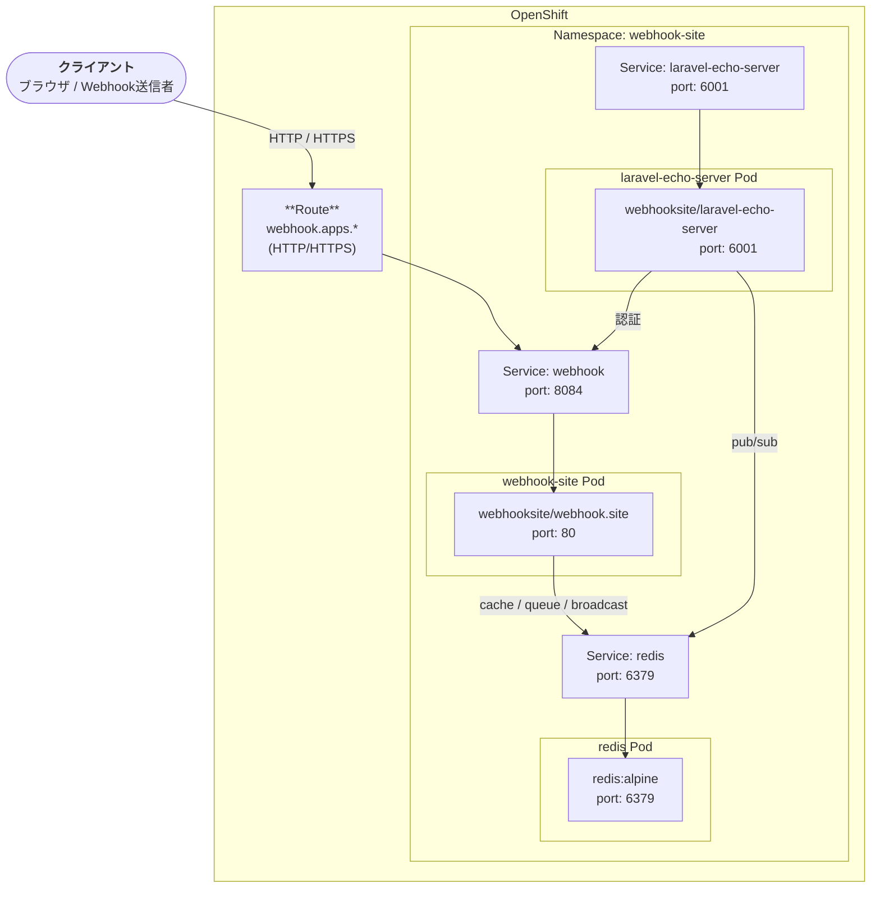

# webhook-site-helm

[webhook.site](https://github.com/webhooksite/webhook.site) を OpenShift 上にデプロイするための Helm チャートです。
Ingress の代わりに OpenShift Route を使用します。

## 構成図



## 構成コンポーネント

| コンポーネント | イメージ | 用途 |
|---|---|---|
| webhook-site | `webhooksite/webhook.site` | Laravel アプリ本体 |
| laravel-echo-server | `webhooksite/laravel-echo-server` | WebSocket サーバ |
| redis | `redis:alpine` | キャッシュ / キュー / ブロードキャスト |

## 前提条件

- OpenShift 4.x クラスタへのアクセス
- Helm 3.x がインストール済み
- デプロイ先 Namespace が作成済み（デフォルト: `webhook-site`）

## インストール

### 1. Namespace の作成

```bash
oc new-project webhook-site
```

### 2. APP_KEY の生成

Laravel アプリに必要な 32 文字のアプリキーを生成します。

```bash
php artisan key:generate --show
# 例: base64:xxxxxxxxxxxxxxxxxxxxxxxxxxxxxxxxxxxxxxxx=
```

PHP が手元にない場合は以下のワンライナーで代替できます。

```bash
echo "base64:$(openssl rand -base64 32)"
```

### 3. Helm インストール

`APP_KEY` は Kubernetes Secret として管理されます。`APP_URL` は `route.host` と `route.tls.enabled` から自動生成されるため、個別に指定する必要はありません。

```bash
helm install webhook-site ./chart \
  --set webhook.env.APP_KEY=base64:xxxxxxxxxxxxxxxxxxxxxxxxxxxxxxxxxxxxxxxx= \
  --set route.host=webhook.apps.mycluster.example.com \
  --set route.tls.enabled=true
```

TLS なしで試す場合（開発用）:

```bash
helm install webhook-site ./chart \
  --set webhook.env.APP_KEY=base64:xxxxxxxxxxxxxxxxxxxxxxxxxxxxxxxxxxxxxxxx= \
  --set route.host=webhook.apps.mycluster.example.com
```

Route ホスト名を OpenShift に自動割り当てさせる場合は `route.host` を省略できます。

#### 既存の Secret を使う場合

Vault や External Secrets Operator などで Secret を別途管理している場合は、`webhook.existingSecret` に Secret 名を指定します。この場合、チャートは Secret を作成しません。

```bash
# Secret を事前に作成
oc create secret generic my-webhook-secret --from-literal=APP_KEY=base64:xxxxxxxxxxxxxxxxxxxxxxxxxxxxxxxxxxxxxxxx=

# existingSecret を指定してインストール
helm install webhook-site ./chart \
  --set webhook.existingSecret=my-webhook-secret \
  --set route.host=webhook.apps.mycluster.example.com \
  --set route.tls.enabled=true
```

## 主な values 一覧

| キー | デフォルト | 説明 |
|---|---|---|
| キー | デフォルト | 説明 |
|---|---|---|
| `namespace` | `webhook-site` | デプロイ先 Namespace |
| `webhook.env.APP_KEY` | `""` | Laravel アプリキー（必須）。Secret に格納される |
| `webhook.existingSecret` | `""` | 既存 Secret 名。指定するとチャートは Secret を作成しない |
| `webhook.env.APP_ENV` | `production` | Laravel 環境 |
| `webhook.env.APP_DEBUG` | `"false"` | デバッグモード |
| `webhook.replicas` | `1` | webhook-site Pod 数 |
| `echoServer.replicas` | `1` | laravel-echo-server Pod 数 |
| `route.host` | `""` | Route のホスト名（空で自動割当） |
| `route.tls.enabled` | `false` | TLS を有効化するか |
| `route.tls.termination` | `edge` | TLS 終端方式（edge / reencrypt / passthrough） |
| `route.tls.insecureEdgeTerminationPolicy` | `Redirect` | HTTP アクセス時の挙動 |

すべての設定は [chart/values.yaml](chart/values.yaml) を参照してください。

## デプロイ後のアクセス方法

`route.host` に設定したホスト名をベースに以下の URL を使用します。

### ブラウザでアクセス

```
https://webhook.apps.mycluster.example.com
```

ブラウザで開くとアプリが自動的にユニークな UUID を生成し、そのページに遷移します。

### Webhook の送信先 URL

ブラウザに表示された UUID 付きの URL がそのまま受信エンドポイントです。

```
https://webhook.apps.mycluster.example.com/{uuid}
```

curl での送信例:

```bash
curl -X POST https://webhook.apps.mycluster.example.com/xxxxxxxx-xxxx-xxxx-xxxx-xxxxxxxxxxxx \
  -H "Content-Type: application/json" \
  -d '{"hello": "world"}'
```

送信すると、ブラウザ画面にリクエストの内容（メソッド・ヘッダー・ボディなど）がリアルタイムで表示されます。
UUID はブラウザセッションごとに異なるため、複数人が同時に別々の受信エンドポイントを持つことができます。

## アップグレード

```bash
helm upgrade webhook-site ./chart -f my-values.yaml
```

## アンインストール

```bash
helm uninstall webhook-site
```
